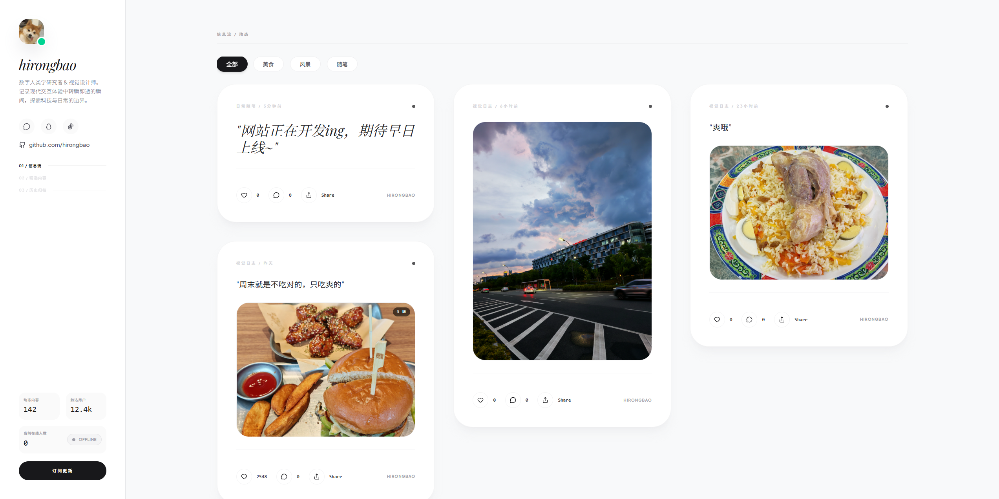

<div align="center">

# hirongbao

**Backend developer · Builder · Digital diary**

记录代码，也记录生活。

<br>

<a href="https://hirongbao.com">
  
</a>

<br>
<br>

<a href="https://hirongbao.com">Personal Website</a>
&nbsp;&nbsp;·&nbsp;&nbsp;
<a href="https://github.com/hirongbao">GitHub</a>

</div>

---

### About

我是 hirongbao，一名后端开发工程师。

喜欢写一些真正能解决问题的东西，也喜欢记录正在发生的事情。

这个页面是我的 GitHub 入口，而我的个人网站则更像是一份持续更新的数字档案。

---

### Selected Projects

<table>
<tr>
<td width="50%">

#### ServiceHub

个人服务中台。

Spring Boot · MySQL · Sa-Token

一个用于管理个人服务、Token 与文件资源的单体多模块项目。

</td>
<td width="50%">

#### Personal Website

个人动态与生活记录。

React · TypeScript · Vite

记录日常、照片、想法，以及一些正在发生的事情。

</td>
</tr>

<tr>
<td width="50%">

#### Dashboard

一些临时使用的小工具。

HTML · JavaScript

为自己解决一些实际问题而做的小型 Web 项目。

</td>
<td width="50%">

#### More

还有一些正在开发中的东西。

有些会公开，有些只属于自己。

</td>
</tr>
</table>

---

### Now

```text
building        ServiceHub
maintaining     personal website
recording       everyday life
learning        something new
